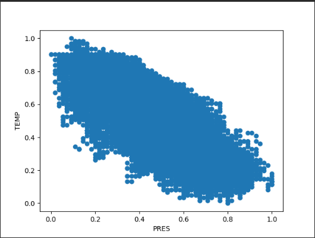

# 处理北京空气质量数据。
首先读入数据
```python
    filename = 'BeijingPM20100101_20151231.csv'
    df = pd.read_csv(filename, encoding='utf-8-sig')
```


## 1.对PM指数进行异常值的处理：假设PM指数最高为500，将PM_Dongsi、PM_Dongsihuan、PM_Nongzhanguan三列中超过500的数据，修改为500。 
先查看所有的异常值
```python
    print("before apply")
    df_ads=df[df['PM_Dongsi']>500]
    print("PM_Dongsi :\n",df_ads)
    df_ads = df[df['PM_Dongsihuan']>500]
    print("PM_Dongsihuan :\n",df_ads)
    df_ads = df[df['PM_Nongzhanguan']>500]
    print("PM_Nongzhanguan :\n",df_ads)

```
结果如下
```
before apply
PM_Dongsi :
           No  year  month  day  hour  ...  TEMP  cbwd    Iws  precipitation  Iprec
27703  27704  2013      2   28     7  ...   2.0    SE  19.23            0.0    0.0
27705  27706  2013      2   28     9  ...   2.0    cv   0.89            0.0    0.0
27706  27707  2013      2   28    10  ...   3.0    cv   1.78            0.0    0.0
27886  27887  2013      3    7    22  ...   6.0    NW   1.79            0.0    0.0
28126  28127  2013      3   17    22  ...   7.0    cv   1.78            0.0    0.0
...      ...   ...    ...  ...   ...  ...   ...   ...    ...            ...    ...
52432  52433  2015     12   25    16  ...  -3.0    SE   7.16            0.0    0.0
52531  52532  2015     12   29    19  ...  -3.0    cv   1.78            0.0    0.0
52532  52533  2015     12   29    20  ...  -3.0    SE   0.89            0.0    0.0
52533  52534  2015     12   29    21  ...  -4.0    cv   0.89            0.0    0.0
52534  52535  2015     12   29    22  ...  -2.0    SE   1.79            0.0    0.0

[70 rows x 18 columns]
PM_Dongsihuan :
           No  year  month  day  hour  ...  TEMP  cbwd    Iws  precipitation  Iprec
28125  28126  2013      3   17    21  ...   8.0    cv   0.89            0.0    0.0
28127  28128  2013      3   17    23  ...   8.0    NW   0.89            0.0    0.0
30591  30592  2013      6   28    15  ...  27.0    SE  37.55            0.0    0.0
30592  30593  2013      6   28    16  ...  27.0    SE  41.57            0.0    0.0
30593  30594  2013      6   28    17  ...  27.0    SE  44.70            0.0    0.0
...      ...   ...    ...  ...   ...  ...   ...   ...    ...            ...    ...
52532  52533  2015     12   29    20  ...  -3.0    SE   0.89            0.0    0.0
52533  52534  2015     12   29    21  ...  -4.0    cv   0.89            0.0    0.0
52536  52537  2015     12   30     0  ...  -6.0    NE   1.79            0.0    0.0
52537  52538  2015     12   30     1  ...  -5.0    NW   1.79            0.0    0.0
52538  52539  2015     12   30     2  ...  -6.0    NE   1.79            0.0    0.0

[75 rows x 18 columns]
PM_Nongzhanguan :
           No  year  month  day  hour  ...  TEMP  cbwd    Iws  precipitation  Iprec
26734  26735  2013      1   18    22  ...  -6.0    NW   0.89            0.0    0.0
26735  26736  2013      1   18    23  ...  -7.0    NW   4.02            0.0    0.0
26736  26737  2013      1   19     0  ...  -6.0    NW   4.91            0.0    0.0
27702  27703  2013      2   28     6  ...   2.0    SE  17.44            0.0    0.0
28126  28127  2013      3   17    22  ...   7.0    cv   1.78            0.0    0.0
...      ...   ...    ...  ...   ...  ...   ...   ...    ...            ...    ...
52431  52432  2015     12   25    15  ...  -2.0    SE   5.37            0.0    0.0
52432  52433  2015     12   25    16  ...  -3.0    SE   7.16            0.0    0.0
52531  52532  2015     12   29    19  ...  -3.0    cv   1.78            0.0    0.0
52532  52533  2015     12   29    20  ...  -3.0    SE   0.89            0.0    0.0
52533  52534  2015     12   29    21  ...  -4.0    cv   0.89            0.0    0.0

[81 rows x 18 columns]
```

然后按要求进行处理
```python
    df['PM_Dongsi'] = df['PM_Dongsi'].apply(lambda x: 500 if x>500 else x)
    df['PM_Dongsihuan'] = df['PM_Dongsihuan'].apply(lambda x: 500 if x>500 else x)
    df['PM_Nongzhanguan'] = df['PM_Nongzhanguan'].apply(lambda x: 500 if x>500 else x)
```

最后对原异常值重新查看
```python
    print("after apply")
    df_ads=df[df['PM_Dongsi']>500]
    print("PM_Dongsi :\n",df_ads)
    df_ads = df[df['PM_Dongsihuan']>500]
    print("PM_Dongsihuan :\n",df_ads)
    df_ads = df[df['PM_Nongzhanguan']>500]
    print("PM_Nongzhanguan :\n",df_ads)

```

结果如下
```
after apply
PM_Dongsi :
 Empty DataFrame
Columns: [No, year, month, day, hour, season, PM_Dongsi, PM_Dongsihuan, PM_Nongzhanguan, PM_US Post, DEWP, HUMI, PRES, TEMP, cbwd, Iws, precipitation, Iprec]
Index: []
PM_Dongsihuan :
 Empty DataFrame
Columns: [No, year, month, day, hour, season, PM_Dongsi, PM_Dongsihuan, PM_Nongzhanguan, PM_US Post, DEWP, HUMI, PRES, TEMP, cbwd, Iws, precipitation, Iprec]
Index: []
PM_Nongzhanguan :
 Empty DataFrame
Columns: [No, year, month, day, hour, season, PM_Dongsi, PM_Dongsihuan, PM_Nongzhanguan, PM_US Post, DEWP, HUMI, PRES, TEMP, cbwd, Iws, precipitation, Iprec]
Index: []
```

## 2.对PRES和TEMP数据进行最大最小归一化和标准化归一化，并使用散点图进行展示。
```python
    df['PRES'] = (df['PRES']-df['PRES'].min())/(df['PRES'].max()-df['PRES'].min())
    df['TEMP'] = (df['TEMP']-df['TEMP'].min())/(df['TEMP'].max()-df['TEMP'].min())
```
使用散点图进行展示后的结果



### 3.针对北京每天的PM平均值（对多个测试站点和多个时间的值求平均），统计不同颜色代表的指数等级（指数等级见课件第23页）各有多少天。


```python
    df['PM_avg'] = df[['PM_Dongsi','PM_Dongsihuan','PM_Nongzhanguan']].mean(axis=1)
    print(df['PM_avg'])
```

```
0               NaN
1               NaN
2               NaN
3               NaN
4               NaN
            ...    
52579    139.666667
52580    168.333333
52581    199.333333
52582    222.333333
52583           NaN
```
很奇怪，为什么会出现NaN，按理来说前面的已经进行过处理了啊，观察后发现，数据居然有本身就有NaN值，所以还要做个筛。
```python
    df_ads = df[df['PM_avg'].isna()]
    print("PM_avg :\n",df_ads)
```
在对每天的PM平均值进行统计时，需要先对数据进行分组，按照年月日进行分组，然后再对每组进行统计，这里使用了transform函数，将统计结果应用到每一行。
```python
   df['PM_avg_day'] = df.groupby(['year','month','day'])['PM_avg'].transform('mean')

    #print(df['PM_avg'])
    df_ads=pd.cut(df['PM_avg'],bins=[0,50,100,150,200,300,500],labels=['优','良','轻度污染','中度污染','重度污染','严重污染'])

```

最后统计结果如下
```python
    df_ads = df_ads.value_counts()
    print(df_ads)
```
显示
```
PM_avg
优       10530
良        6511
轻度污染     3753
中度污染     2010
重度污染     1838
严重污染      927
```

