# 2023 Python程序设计大作业：租房数据分析

## 1. 数据抓取

### 页面分析

通过谷歌浏览器提供的开发者工具，能找到租房信息的网页html中有我们所需要爬取的信息,并且都位于一个div元素下
`<div class="content__list"></div>`

所以我们可以通过这种XPath路径进行爬取，`response.xpath("//*[@id='content']/div[1]/div[1]/*")`

然后通过静态和动态调试，能够发现我们正确获取的所需要的信息，其中一个模块如下

[因长度过大，选择插入链接](https://github.com/pleasenott/python/blob/main/da.html)

通过谷歌浏览器开发者工具提供的XPath复制和查找功能，我们可以找到我们所需要的信息的XPath路径。

这样创建几个对应的item，就可以将数据存储到对应的item中，然后再通过pipelines.py中的代码，将数据存储到对应的csv文件中。


### 代码编写

#### 1. 爬虫代码
使用之前的python爬虫框架，重新编写了5个爬虫（分别对应北京，上海，广州，深圳，以及郑州5个城市），并且将爬虫的代码进行了封装，使得代码更加简洁，易于阅读。

下面以bj代码为例，进行说明：

```python
import scrapy

from test1.items import Test1Item  # 从items.py中引入MyItem对象


class LianjiaSpider(scrapy.Spider):
    name = 'bj'
    allowed_domains = ['bj.lianjia.com']
    # https://bj.lianjia.com/zufang/pg2/
    base_url = 'https://bj.lianjia.com/zufang/'


    maxpage = 200
    # 最大爬取页数

    def __init__(self, **kwargs):
        super().__init__(**kwargs)
        self.download_delay = 1
        with open("bj.txt", "r") as f:
            # 读取上次爬取的页数
            self.begin_index = int(f.read())
            self.page_index=self.begin_index
            self.start_urls = [self.base_url + "pg" + str(self.begin_index)]
            print(self.begin_index)
            f.close()
        with open("bj.txt","w") as f:
            # 更新爬取的页数
            f.write(str(self.begin_index+self.maxpage))
            f.close()

    def parse(self, response, **kwargs):
        for each in response.xpath("//*[@id='content']/div[1]/div[1]/*"):
            item = Test1Item()
            item['price'] = each.xpath("div/span/em/text()").extract_first()
            if '-' in item['price']:
                temp = item['price'].split("-")
                item['price'] = (float(temp[0]) + float(temp[1])) / 2
            temp = each.xpath("div/p[1]/a/text()").extract_first()
            # 从temp中提取数据
            temp = temp.split(" ")
            item['name'] = temp[0]
            item["house_type"] = ""
            item["area"] = ""
            item["direct"] = ""
            item["name_chinese"] = "北京"
            for i in temp:
                if '室' in i or '厅' in i or '卫' in i:
                    item['house_type'] = i
                if '东' in i or '南' in i or '西' in i or '北' in i:
                    if len(i) < 5:
                        item['direct'] = i
            temp = each.xpath("div/p[2]/text()").extract()
            for i in temp:
                if '㎡' in i:
                    i = i.replace("㎡", "").replace(" ", "").replace("\n", "")
                    if "-" in i:
                        temp = i.split("-")
                        item['area'] = (float(temp[0]) + float(temp[1])) / 2
                    else:
                        item['area'] = i
            item["block"]=each.xpath("div/p[2]/a[2]/text()").extract_first()
            print(item["block"])
            if item['price'] and item['name'] and item['house_type'] and item['area'] and item['direct'] and item["block"]:
                yield item
        self.page_index += 1
        if self.page_index > self.maxpage+self.begin_index-1:
            return
        url=self.base_url+"pg"+str(self.page_index)

        print(url)
        
        yield scrapy.Request(url, callback=self.parse)
        # 递归爬取下一页
```

通过一个bj.txt文件，记录上次爬取的页数，然后通过递归爬取下一页的方式，实现了爬取多页的功能。这样在多次爬取时只需要修改爬虫的名字和pipe中输出的文件名就能实现多个城市的爬取。

#### 2. 数据处理代码

在pipelines.py中，我们对数据进行了处理，将数据存储到对应的csv文件中。

```python
import json
import csv
class Test1Pipeline:

    def open_spider(self, spider):
        try:
            self.file = open('zz.csv', "a", encoding="utf-8-sig", newline='')#这里的zz表示郑州，可以修改为其他城市的名字
            self.writer = csv.writer(self.file)
        except Exception as err:
            print(err)

    def process_item(self, item, spider):
        list_item = [item['name_chinese'], item['block'],item['house_type'], item['direct'], item['area'], item['price']]
        self.writer.writerow(list_item)
        return item
    def close_spider(self, spider):
            self.file.close() #关闭文件
```

#### 3. 运行代码

在main.py中，我们通过调用execute函数，运行爬虫代码。

```python
from scrapy import cmdline
cmdline.execute("scrapy crawl zz".split())
```


## 2. 数据获取


### 运行代码

为防止爬取大量数据时，被网站封禁，我们将爬取的数据分为多次爬取，每次爬取300-500页，然后将爬取的数据存储到对应的csv文件中。

### 发现问题

本来以为爬取的数据量不会很大，但是在爬取的过程中，发现了一些问题：

开始通过chorme浏览器发现https://bj.lianjia.com/zufang/pg1233/这个网页是存在的，但是通过爬虫爬取时，发现这个网页中的数据很不友好，实际上是重复的，这就很让人头疼。

想到的解决方法是重写一下parse函数，对每个区进行遍历，后面发现对区进行遍历都不甚足够，所以改为对板块进行遍历，由于板块较多，为了不修改代码框架，所以另写一个爬虫，将板块的数据爬取下来，然后再通过板块的数据进行遍历，这样就能够爬取到所有的数据了。

```python
filename="tool.txt"
        with open(filename, "a") as f:
            for each in response.xpath("//*[@id='filter']/ul[4]/*"):  # 遍历可选的板块
                data_id = each.xpath("@data-id").extract_first()
                if data_id is None or data_id == "0":  # 板块选项的第一个是不限，跳过
                    continue
                newblock = each.xpath("a/@href").extract_first()
                newblock = newblock.replace("/zufang/", "").replace("/", "")
                if newblock not in self.out_list:
                    self.out_list.append(newblock)
                    f.write("\""+newblock +"\",")
            if self.num<len(self.zone_list):
                url = self.base_url + self.zone_list[self.num] + "/pg1"
                self.num=self.num+1
                yield scrapy.Request(url, callback=self.parse)
```


## 3. 总体房租情况比较


### 代码编写
这里使用jupyter进行编写，因为能方便的进行输出，以及进行数据的可视化。看起来会舒服许多许多
不过缺点是有点长了，所以这里仅仅加入一个引用的代码[总体和户型](https://github.com/pleasenott/python/blob/main/test1/he.ipynb)

### 结果展示
总体房价如下图所示，能看到不同城市的数据有很大差别，参考平均数或者中位数的话，能发现深圳的房价最高，郑州的房价最低，
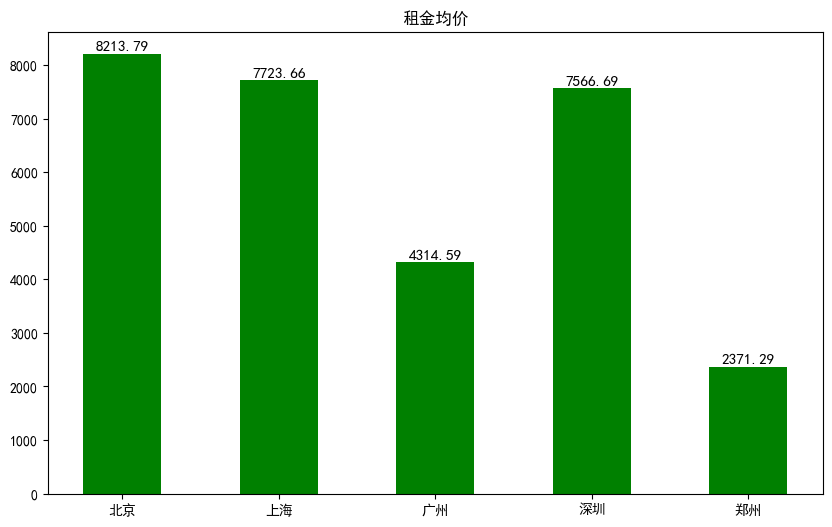


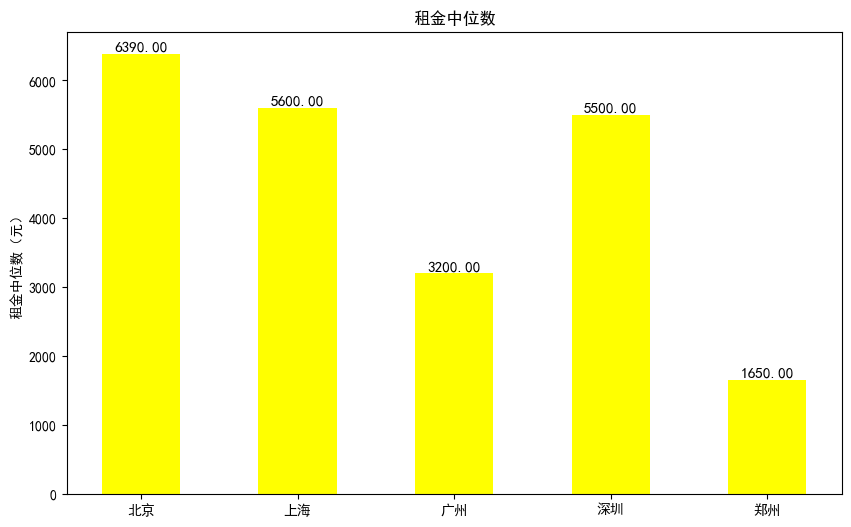


广州的数据十分奇怪，能看到极低的最低价，经查找后发现并非是因为爬取错误导致的，也没有必要去除特殊值。


## 4. 不同户型比较

比较5个城市一居、二居、三居的情况，包含均价、最高价、最低价、中位数等信息，采用合适的图或表形式进行展示。

### 代码编写
与上面的代码类似，这里仅仅加入一个引用的代码[总体和户型](https://github.com/pleasenott/python/blob/main/test1/he.ipynb)
同时部分代码展示如下
```python
plt.figure(figsize=(10, 6))
plt.bar(result.keys(), [result[i]["租金的最高价"] for i in result.keys()], width=0.5,color="blue")
#对每个柱子进行标注
for a,b in zip(result.keys(), [result[i]["租金的最高价"] for i in result.keys()]):
    plt.text(a, b+15, '%.2f' % b, ha='center', va= 'bottom',fontsize=11)
plt.title("租金最高价")
plt.show()
```

对户型的转化处理，将不属于123居的户型数据丢弃掉
```python
for i in range(len(citynamelist)):
    df_list[i]["house_type"]=df_list[i]["house_type"].apply(get_house_type)
    df_list[i]=df_list[i].drop(df_list[i][df_list[i]["house_type"]>3].index)
    df_list[i]=df_list[i].drop(df_list[i][df_list[i]["house_type"]<1].index)
    df_list[i]=df_list[i].dropna()
    df_list[i]=df_list[i].drop_duplicates()
    df_list[i]=df_list[i].reset_index(drop=True)
    print(citynamelist_chinese[i]+"的数据数量为：",len(df_list[i]))

北京的数据数量为： 34705
上海的数据数量为： 25714
广州的数据数量为： 42807
深圳的数据数量为： 16220
郑州的数据数量为： 19014
```


### 结果展示
下面是不同户型的数据，能看到不同城市的数据有很大差别，参考平均数或者中位数的话，能发现大部分城市都是三居价格最高，但是单位面积价格一居最高。


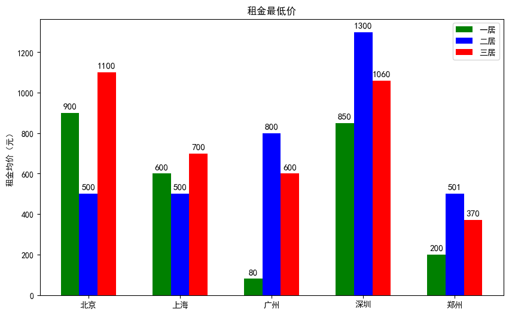

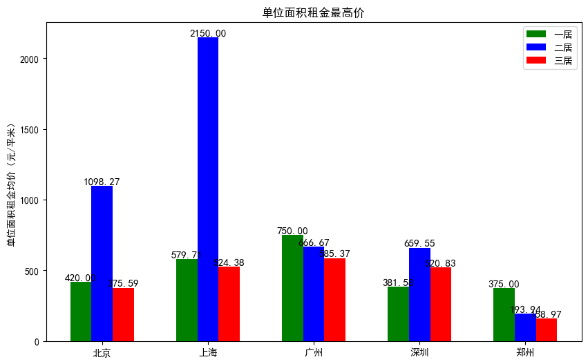
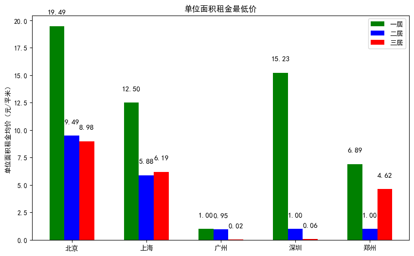
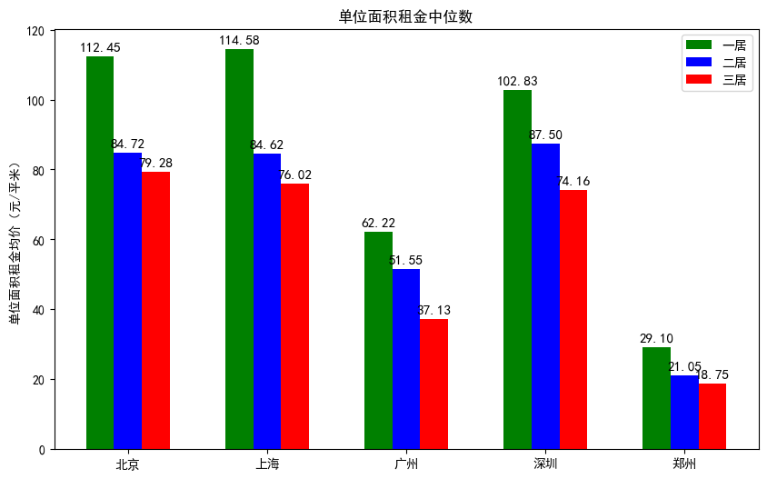


## 5. 板块均价比较

### 代码编写
与上面的代码类似,[板块均价](https://github.com/pleasenott/python/blob/main/test1/he2.ipynb)
同时部分代码如下
    
```python
    plt.rcParams['font.sans-serif'] = ['SimHei']
for i in range(len(citynamelist)):
    plt.figure(figsize=(3,5))
    cityname=citynamelist[i]
    df=df_list[i]
    block_list=df["block"].unique()
    block_price_list=[]
    for block in block_list:
        block_price_list.append(df[df["block"]==block]["price"].mean())
    plt.boxplot(block_price_list)
    plt.title(citynamelist_chinese[i])
    plt.ylabel("均价(元/月)")
```

### 结果展示
以北京数据为例，展示一小部分
- 安定门,7562.777777777777
- 安贞,8072.0
- 朝阳门外,11015.08510638298
- 朝阳门内,9965.333333333334
- 崇文门,11040.795918367347

总的数据在下面的文件中

[北京板块均价](https://github.com/pleasenott/python/blob/main/test1/bjoutput.csv)
[上海板块均价](https://github.com/pleasenott/python/blob/main/test1/shoutput.csv)
[广州板块均价](https://github.com/pleasenott/python/blob/main/test1/gzoutput.csv)
[深圳板块均价](https://github.com/pleasenott/python/blob/main/test1/szoutput.csv)
[郑州板块均价](https://github.com/pleasenott/python/blob/main/test1/zzoutput.csv)

这里采用散点图来表示，因为散点图能够很好的表示数据的分布情况，而且能够很好的表示数据的异常情况，比如上海的某个板块的均价就很高，这样的数据就很容易被发现。

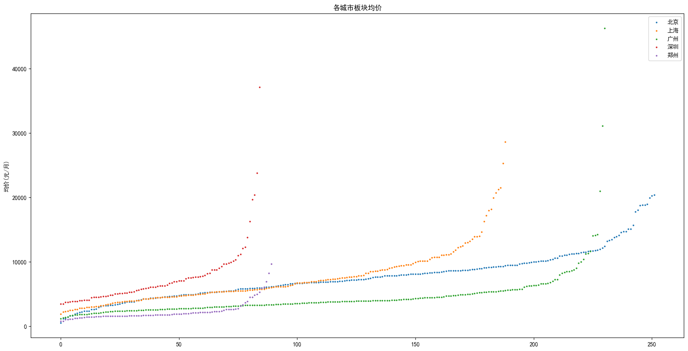

下面是各个城市的板块数量的散点图，为了能从中看出城市里不同板块中房子的数量，所以对数据进行了一些基本的归一化处理，然后再进行绘图。这里能从图上看出来，北京的板块数据相对分散，而上海的板块数据相对集中，这样的数据也能够很好的反映出城市的特点。


下面对五个城市的板块价格进行了箱线图的绘制，从图中能够看出每个城市板块价格的分布情况，以及每个城市板块价格的异常情况，比如上海的某个板块的均价就很高，这样的数据就很容易被发现同时也能直观地观察到方差等数据。

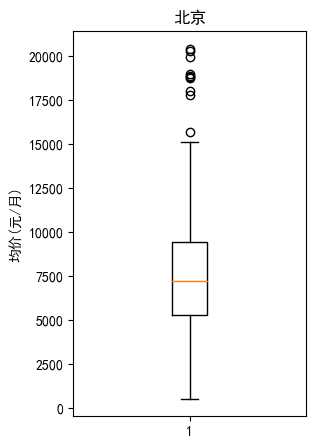


## 6. 朝向租金分布比较

比较各个城市不同朝向的单位面积租金分布情况，采用合适的图或表形式进行展示。哪个方向最高，哪个方向最低？各个城市是否一致？如果不一致，你认为原因是什么？

### 代码编写

与上面的代码类似,[朝向租金分布总代码](https://github.com/pleasenott/python/blob/main/test1/he3.ipynb) 

同时部分代码如下

```python
plt.rcParams['font.sans-serif'] = ['SimHei']
plt.rcParams['axes.unicode_minus'] = False
for i in range(len(citynamelist)):
    plt.figure(figsize=(6,6))
    plt.pie(result[citynamelist_chinese[i]],labels=result[citynamelist_chinese[i]].index,autopct='%1.1f%%', shadow=True,explode=[0.1,0.1,0.1,0.1,0.1,0.1,0.1,0.1],
        radius=1.0)
    plt.title(citynamelist_chinese[i]+"的房源朝向分布")
    #plt.savefig(citynamelist_chinese[i]+"的房源朝向分布.png")
    plt.show()
```
下面是热力图的绘画
```python
for i in range(len(citynamelist)):
    plt.figure(figsize=(10,6))
    print()
    sns.heatmap(df_list[i].groupby(["direct","name_chinese"])["price"].mean().unstack(),annot=True,fmt='.0f',cmap='RdYlGn_r')
    plt.title(citynamelist_chinese[i]+"的房源朝向与板块的平均价格")
```
### 结果展示
下面五张图表示了各个城市中不同朝向的比例，能看到不同城市朝向分布有很大差别，也许是受气候风俗等影响

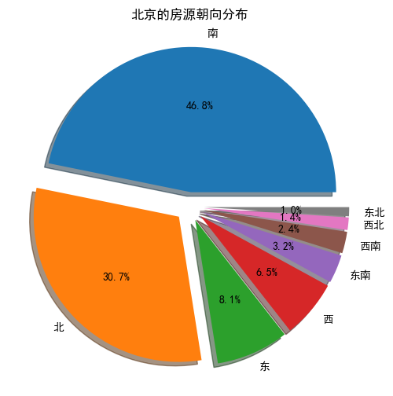
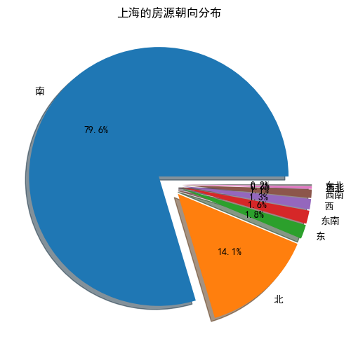


<!-- 

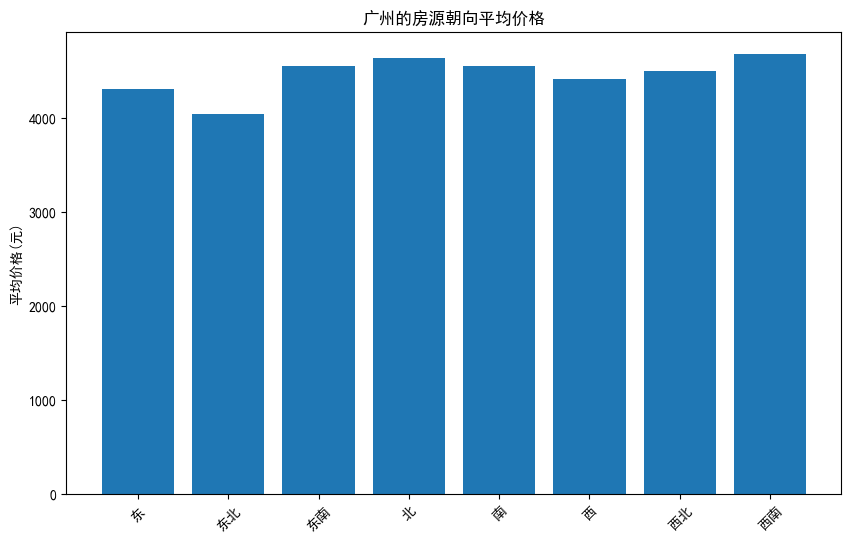

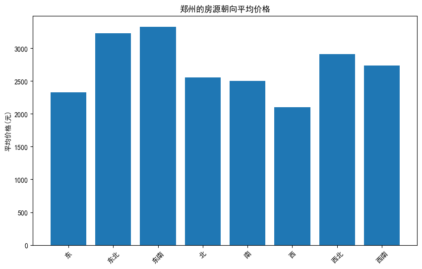 -->
<!-- <div style="overflow-x: scroll; white-space: nowrap;">
  
  
    
    
    


</div>
 -->
下面是城市和朝向的单位面积价格的热力图，颜色越深，价格越低，不同朝向对房价的影响不甚明显，数据中所有城市南向租金都相对较低，这里或许是因为南向的房子数据更多，不容易产生偏差导致的，

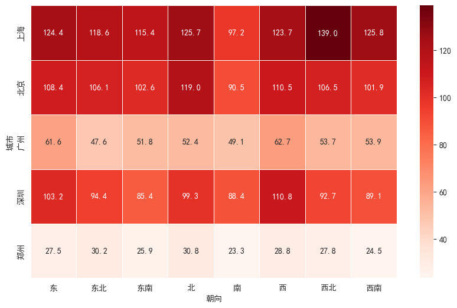


## 7. 城市平均工资与租金分布关系

查询各个城市的平均工资，分析并展示其和单位面积租金分布的关系。比较一下在哪个城市租房的负担最重？
### 数据获取
根据各地区人力资源和社会保障局所提供的数据

- 北京,135567 11297 [数据来源](https://rsj.beijing.gov.cn/bm/ywml/202007/t20200717_1950961.html)
- 上海 136757 11396 [数据来源](https://www.rsj.sh.gov.cn/201712333/xxgk/index.shtml)
- 广州  130596 10883 [数据来源](http://tjj.gz.gov.cn/hdjlpt/detail?pid=2663116)
- 深圳 164754 13729  [数据来源](http://tjj.sz.gov.cn/gkmlpt/content/10/10683/post_10683203.html#4222)
- 郑州 93191  7766  [数据来源](https://tjj.zhengzhou.gov.cn/u/cms/tjj/statistical_2022/index.htm)

中国人均居住面积 41.76平方米 [数据来源](http://finance.people.com.cn/n1/2022/0810/c1004-32499201.html)
中国人均住房支出占比 24% [数据来源](https://www.stats.gov.cn/sj/zxfb/202302/t20230203_1901715.html)
### 数据分析

#### 代码编写

```python
plt.hist(df_list[i]['price']/df_list[i]['area'].astype('float64'),bins=100,label=citynamelist_chinese[i],alpha=0.5)
```
#### 结果展示
下面是各个城市的平均工资和租金的数据图，放在一起方便对比，能看到深圳的收入最高，郑州的收入最低。但是感觉不够直观，因为深圳的房价也最高。所以后面又绘制了6个图来进行比较

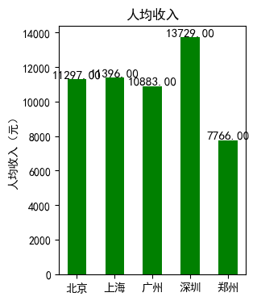

下面6个图是单位面积租金分布和平均工资对应租房月支出的对比图，其中计算逻辑为：中国人均住房支出占比*平均工资/人均居住面积，能看到北京和上海的租房负担最重，郑州的租房负担最轻，平均工资能租起绝大多数房子

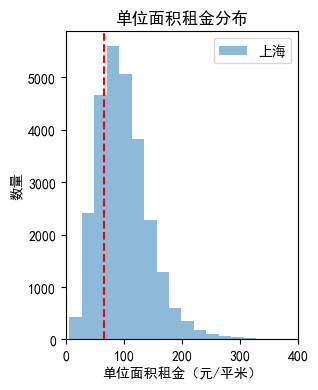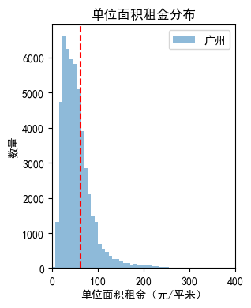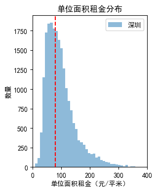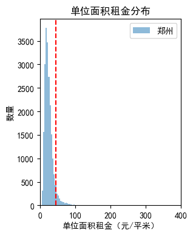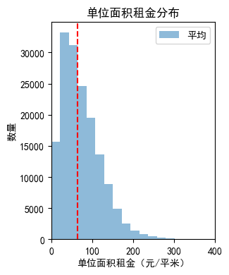
## 8. 与2022年数据对比


### 代码编写
因为2022年的租房数据格式是json，所以需要一个程序进行转化
```python
import json
import csv
import os
file_list_chinese=['北京','上海','广州','深圳']
filename_list=["BeijingHouseInfo.json","ShanghaiHouseInfo.json","GuangzhouHouseInfo.json","ShenzhenHouseInfo.json"]
file_list=["bj","sh","gz","sz"]
for i in range(4):
    with open(filename_list[i],'r',encoding='utf-8') as f:
        with open(file_list[i]+'.csv','w',encoding='utf-8',newline='') as f1:
            writer=csv.writer(f1)
            writer.writerow(['name_chinese','block','house_type','direct','area','price'])
            for line in f.readlines():
                dic=json.loads(line)
                writer.writerow([file_list_chinese[i],dic['district'],dic['layout'],dic['direction'].split(" ")[0],dic['area'],dic['total_price']])
```
通过百分比变化率来衡量变化情况，考虑到如无特殊情况出现，所属板块，朝向，室型变化应该不大，所以这里将阈值设置较高，
```python
plt.rcParams['font.sans-serif'] = ['SimHei']
for i in range(len(citynamelist)):
    for datatype in ["direct","house_type"]:
        for j in range(len(result_2022[i][datatype])):
            print(result_2022[i][datatype].index[j])
            if result_2022[i][datatype].index[j]=="nan":#做平均后出现非数了，就跳过
                continue
            #对比一下数据，差距大就输出
            if (abs(result_2022[i][datatype][result_2022[i][datatype].index[j]]-result_2023[i][datatype][result_2022[i][datatype].index[j]])/result_2022[i][datatype][result_2022[i][datatype].index[j]])>0.2:
                print(result_2022[i][datatype][result_2022[i][datatype].index[j]])
                print(result_2023[i][datatype][result_2022[i][datatype].index[j]])
                plt.bar([citynamelist_chinese[i]+"2022",citynamelist_chinese[i]+"2023"],[result_2022[i][datatype][result_2022[i][datatype].index[j]],result_2023[i][datatype][result_2022[i][datatype].index[j]]])
                plt.title(citynamelist_chinese[i]+datatype+result_2022[i][datatype].index[j])
                plt.show()

```
[完整代码](https://github.com/pleasenott/python/blob/main/test1/he5.ipynb)
### 结果展示

首先是转化后的数据，这里只展示了北京的数据，其他城市的数据在对应的文件夹中

北京,安定门,1室1厅1卫,东,42.92,5200

其他数据列在下面

[北京](https://github.com/pleasenott/python/blob/main/test1/RawData/bj.csv)
[上海](https://github.com/pleasenott/python/blob/main/test1/RawData/sh.csv)
[广州](https://github.com/pleasenott/python/blob/main/test1/RawData/gz.csv)
[深圳](https://github.com/pleasenott/python/blob/main/test1/RawData/sz.csv)


### 结果分析
观察到数据变化较大的是深圳的户型，其中1室的房子数量变化超过了设定的阈值20%，而其他数据的变化都在阈值之内，查询资料后发现，深圳相关部门正努力改善居住环境，提高人均居住面积，详见[关于进一步加大居住用地供应的若干措施](http://sf.sz.gov.cn/ztzl/gfxwj/cnqkfk_171009/content/post_9051624.html)
，所以一室租房数量下降也是正常的。
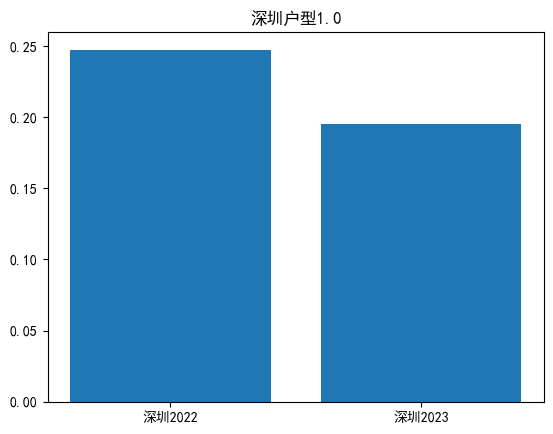

对于单位面积价格的对比，能看到四个城市房价均有所下降，其中深圳价格下降最快，广州价格基本没有变化，北京上海增长率位于深圳和广州之间。
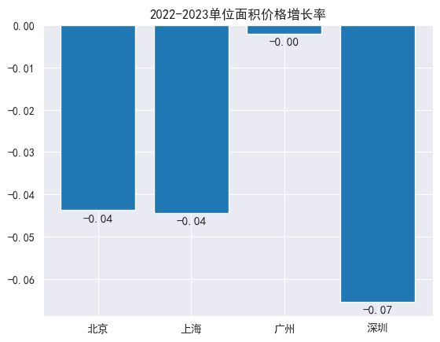
